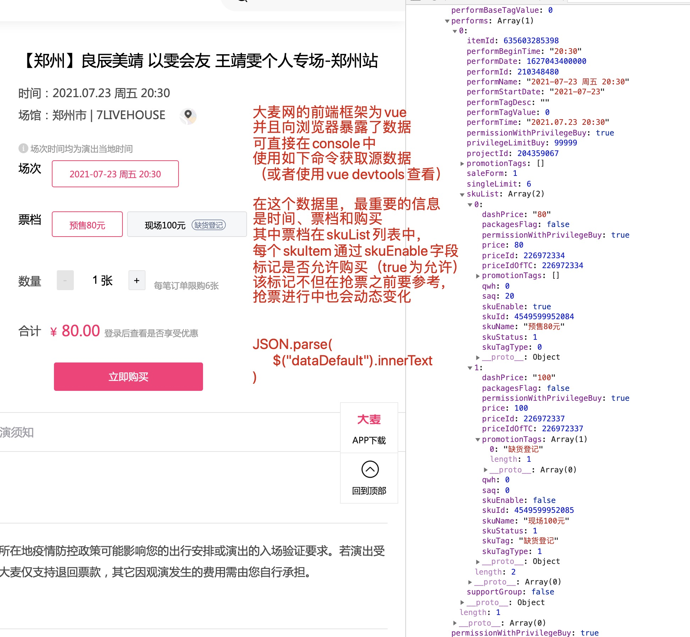

# 大麦网抢票程序设计与应用

> 首先感谢往上oliwang的油猴脚本（ [大麦抢票-完整](https://greasyfork.org/en/scripts/408874-%E5%A4%A7%E9%BA%A6%E6%8A%A2%E7%A5%A8-%E5%AE%8C%E6%95%B4) ）和B站一些用户的手动抢票实录视频，基本上可以写出高可用、高性能的大麦网抢票程序了。
> 
> 以下附上详细的程序分析、设计与实现。
>

## 前端分析

测试地址1： [【郑州】良辰美靖 以雯会友 王靖雯个人专场-郑州站【网上订票】- 大麦网](https://detail.damai.cn/item.htm?spm=a2oeg.search_category.0.0.35274d15VsHRmB&id=635603285398&clicktitle=%E8%89%AF%E8%BE%B0%E7%BE%8E%E9%9D%96%20%E4%BB%A5%E9%9B%AF%E4%BC%9A%E5%8F%8B%20%E7%8E%8B%E9%9D%96%E9%9B%AF%E4%B8%AA%E4%BA%BA%E4%B8%93%E5%9C%BA-%E9%83%91%E5%B7%9E%E7%AB%99)




```js
JSON.parse($("#dataDefault").innerText)
```

## 脚本优化
oliwang的脚本为`oliwang-main-0.0.3.js`，基于它的脚本改进为`mark-main-0.0.1.js`，改进将持续进行，直到本项目完结。改进主要集中在代码风格、代码质量和一些关键逻辑的修正或补充上。

## 抢票系统的设计与实现
计划分客户端和服务端分步进行。
### 服务端
对于服务端，直接使用postman进行接口分析，然后开发python或者js脚本。

### 客户端
- 首先基于oliwang的油猴脚本进行代码优化与二度开发，然后重新提交到油猴测试。
- 如果测试通过，则即可以选择直接使用油猴脚本，也可以考虑在自建服务器上搭建一个大麦网的沙盒，方便客户直接下单，免去用户手动配置油猴的琐碎过程。

